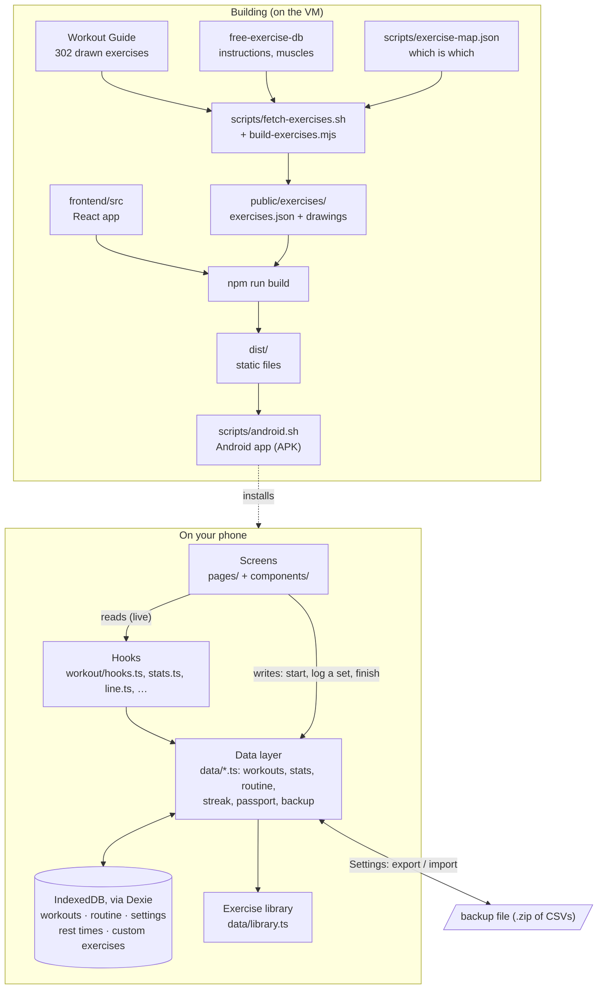
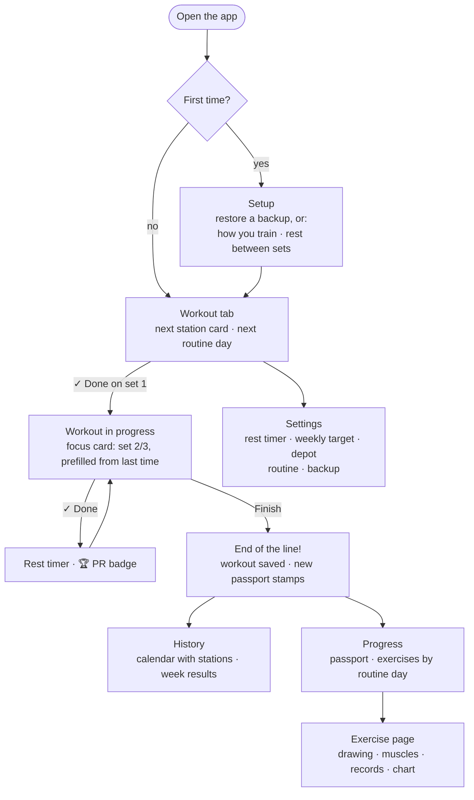
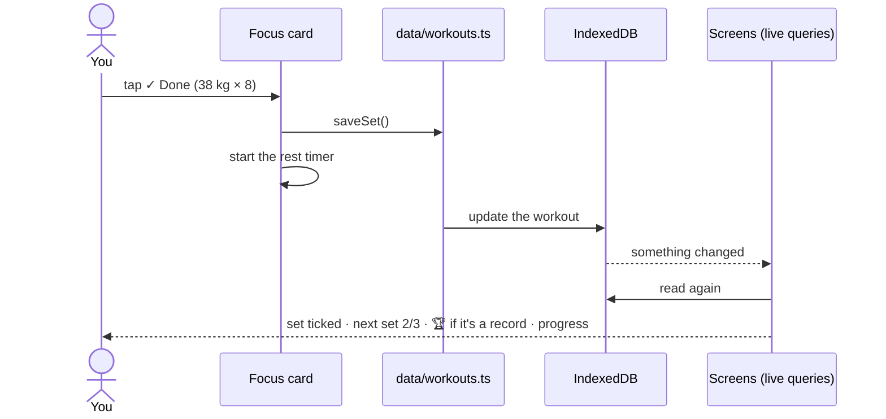

# How gains-train works

gains-train is an Android app without a server: a web app packaged with Capacitor, and
everything you log stays on your phone. These three diagrams go from the big picture to a
single tap.

## 1. The big picture

Where the code, the exercise library and your data live, from building to running.

- **No server, no accounts.** The app talks to nothing but its own files, and doesn't even
  have internet permission.
- **Screens update by themselves.** Hooks use Dexie's live queries: when anything changes in
  the database, every screen showing it re-renders. Nothing is refetched or synced.
- **Derived, not stored.** Stats, records, the Gains Line streak and the passport are worked
  out from your workouts each time, so restored history counts and edits never go stale.
- **Backups are yours.** The export file is the only way data leaves the phone.

## 2. Your route through the app

## 3. Logging one set

What happens behind the scenes when you tap ✓ Done.

Everything on the right happens on the phone in a few milliseconds; there's no network in
between.
